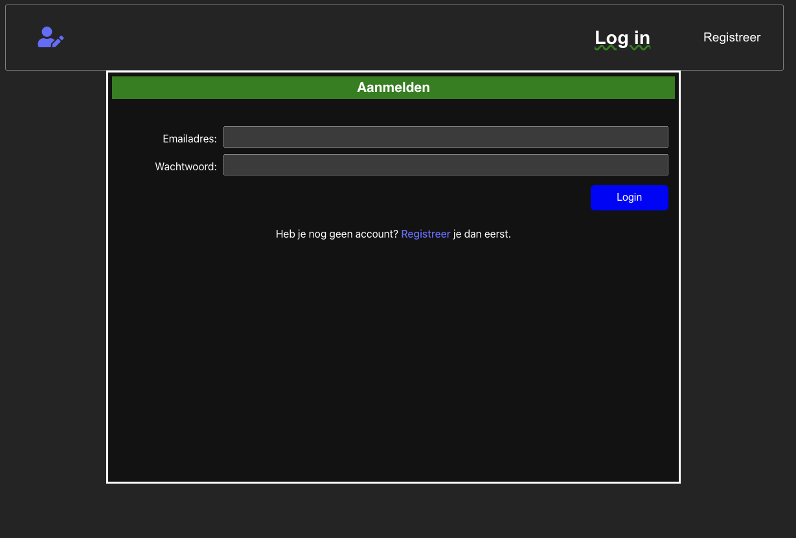
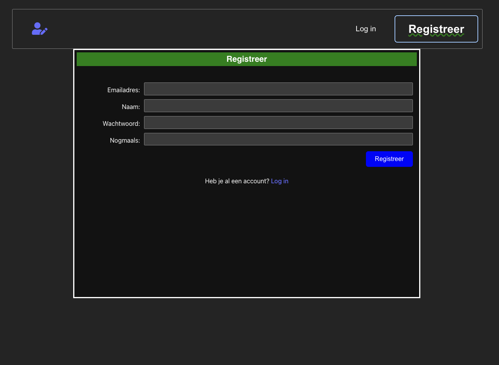
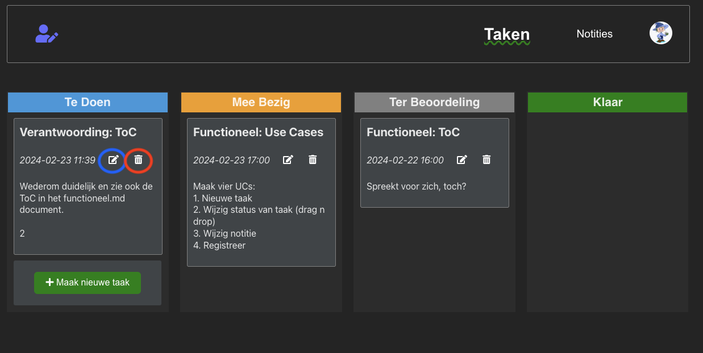
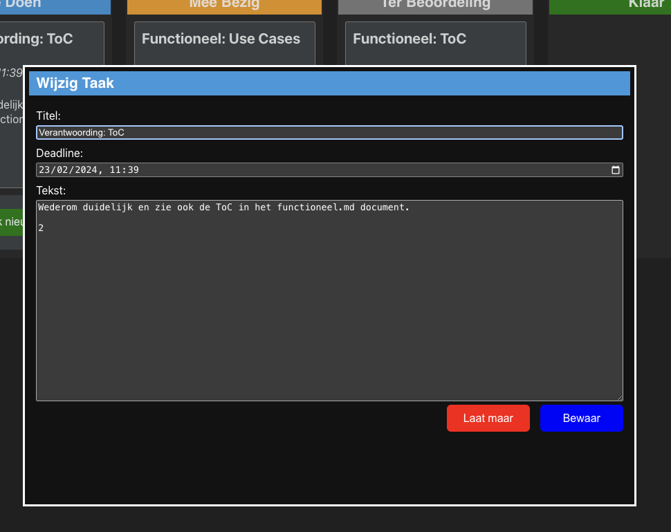
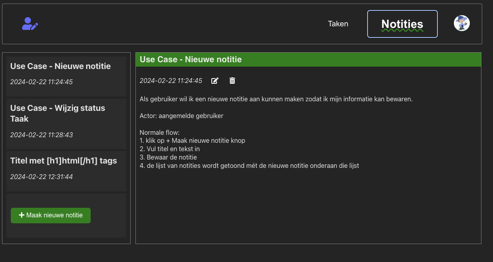
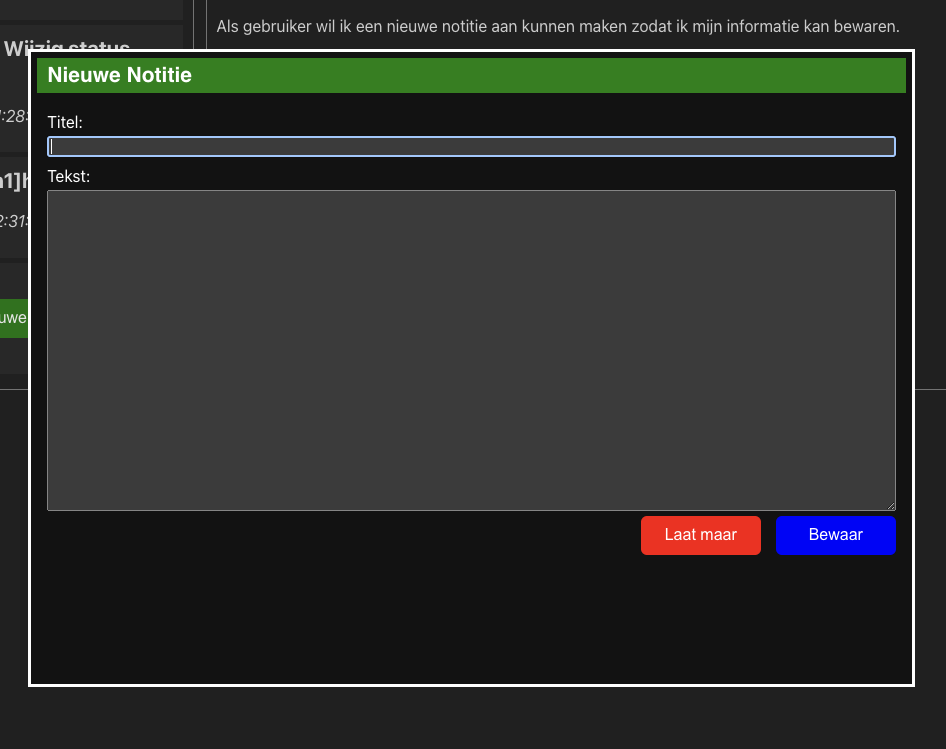
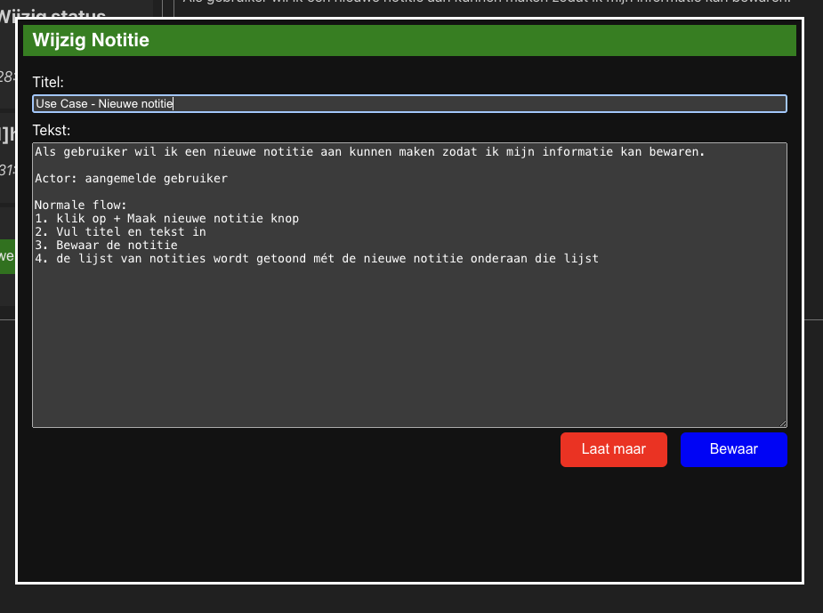
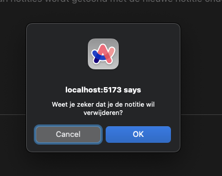

# EindOpdracht FrontEnd 2023/24 van de NOVI Software Engineer studie

## Deelopdrachten

Voor deelopdracht 1. [Functioneel ontwerp](docs/functioneel.md)

Voor deelopdracht 2. [Verantwoordingsdocument](docs/verantwoording.md)

Voor deelopdracht 3. [Broncode React Applicatie](src/)

Voor deelopdracht 4. [Installatiehandleiding](#installatiehandleiding)

## Installatiehandleiding

### Voorwaarden

Voor het clonen (kopieren) van de JavaScript + HTML + CSS code is `git` vereist. Zie voro de installatie van `git` [deze](https://git-scm.com/book/en/v2/Getting-Started-Installing-Git) site.

Het uitvoeren van deze applicatie heeft `npm` nodig. Nog geen `npm`? Ga dan naar [npm installatie](https://docs.npmjs.com/downloading-and-installing-node-js-and-npm) waar een uitgebreide handleiding voor installatie van `npm` staat.
Voor de meeste gebruikers kan [download](https://docs.npmjs.com/downloading-and-installing-node-js-and-npm#using-a-node-installer-to-install-nodejs-and-npm) de makkelijkste route zijn.

### Installatie Applicatie

Drie eenvoudige stappen:
1. Kopieer het project lokaal met `git clone https://github.com/jvorhauer/novi-fe24-eindopdr.git`
2. Ga naar de nieuwe directory: `cd novi-fe24-eindopdr`
3. Voer nu `npm install` uit en wacht tot het internet helemaal gedownload is
4. Installatie is nu klaar

### Uitvoeren

Voer de applicatie uit met `npm run dev`.

## Gebruik

Voor het gebruik van deze app is het noodzakelijk om aan te melden, zodat iedere gebruiker zijn of haar notities en taken kan terugvinden, bewerken, creeren of verwijderen.

Na het openen van [de applicatie](http://localhost:5173) met een browser wordt het inlog scherm getoond:

Om aan te kunnen melden moet de gebruiker over een account in de app beschikker. Een account kan verkregen worden door te registreren:

Na succesvol inloggen wordt het taken overzicht van de aangemelde gebruiker getoond. In dit overzicht heeft iedere taak een "wijzig" knop (in de blauwe 
cirkel van de "Verantwoording: ToC") taak en een "verwijder" knop (rode cirkel):

Op het taken scherm kan dan, onder andere, een nieuwe taak gemaakt worden:

Of een bestaande taak kan gewijzigd worden:

We gaan verder naar notities, die getoond worden in een lijst, met standaard de eerste (oudste) notitie getoond in het detail-deel van de pagina:

Ook hier kan een nieuwe notitie gemaakt worden:

En een bestaande notities kan gewijzigd worden. De knop voor het starten van een wijziging is hetzelfde als op het taken overzicht scherm:

En last, but not least, het verwijderen van een notitie of taak heeft een confirm-box tot gevolg. Deze kan er in een andere browser anders uitzien dan 
hier getoond!

Tot zover de schermen van de applicatie.
