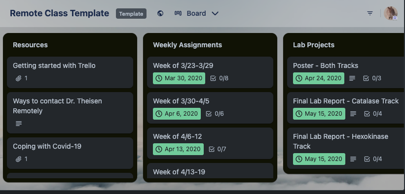
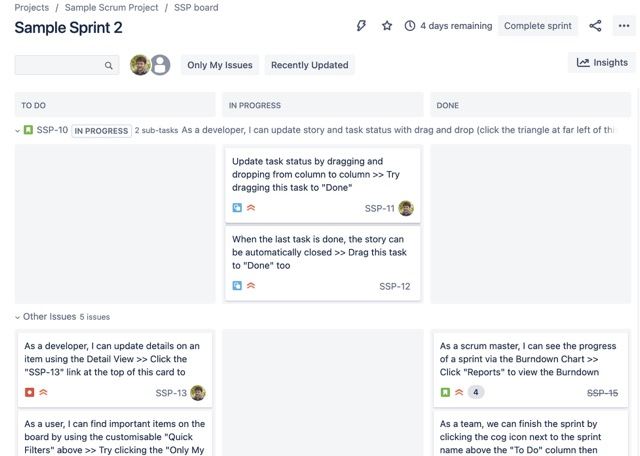
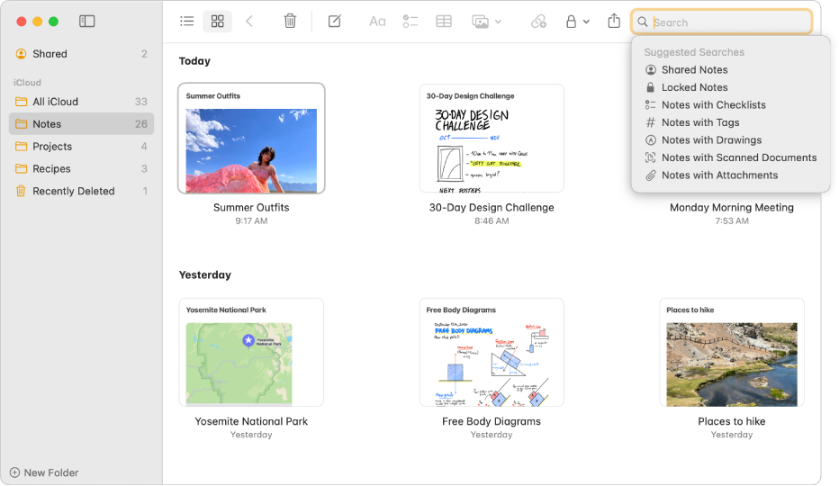
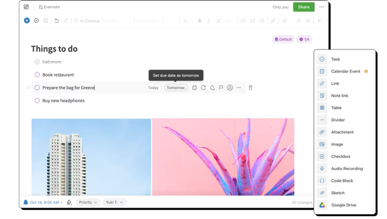
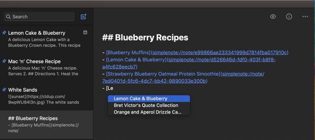

* [Introductie](#introductie)
* [Functionele Eisen](#functionele-eisen)
* [Niet-Functionele Eisen](#niet-functionele-eisen)
* [Use Cases](#use-cases)
* [Inspiratie](#inspiratie-bronnen)

## Introductie

Dit document beschrijft de functionele en niet-functionele eisen aan een taak- en notitie registratie en beheer systeem.
Als informatie-werker is het noodzakelijk om overzicht te houden van kennis, in notities, en werkzaamheden, in taken.
De te bouwen applicatie gaat functionaliteit bieden voor deze beide onderwerpen en wel op een begrijpelijke en degelijke wijze.

Daarom:

* Taken worden overzichtelijk weergegeven en zijn eenvoudig van status te veranderen.
* Notities worden in een nette lijst weergegeven.

## Functionele Eisen

1. Als gebruiker wil ik me kunnen registreren zodat ik van de faciliteiten van NoPaN gebruik kan maken
   * registratie met email adres, password en naam
   * email adres moet uniek zijn
   * naam mag niet leeg zijn
   * password moet minimaal 7 karakters lang zijn
2. Als gebruiker wil ik me kunnen aanmelden, zodat ik mijn taken en notities kan beheren
3. Als geregistreerde gebruiker wil ik mijn [Gravatar](https://gravatar.com/profile) die bij mijn email adres hoort zien zodat de boel wat vrolijker wordt
4. Als aangemelde gebruiker wil ik me kunnen afmelden zodat mijn device door iemand anders gebruikt kan worden (praktisch wordt men afgemeld als er op 
  die gravatar afbeelding wordt geklikt; heeft een email adres geen bijbehorende gravatar, dan wordt een generieke afbeelding getoond)
5. Als gebruiker wil ik een nieuwe taak aanmaken, zodat ik deze kan onthouden
   * Als gebruiker wil ik een taak een titel, vrije tekst en een deadline datum + tijd kunnen geven zodat ik later kan teruglezen wat ik bedoelde
   * de titel en vrije tekst mogen niet leeg zijn
   * de datum + tijd moeten in de toekomst liggen
6. Als gebruiker wil ik een bestaande taak een andere status kunnen geven zodat ik de voortgang kan (laten) zien
   * door middel van drag & drop kan de status aangepast worden
7. Als gebruiker wil ik een bestaande taak inhoudelijk wijzigen zodat deze weer de werkelijke bedoeling weergeven
   * titel en vrije tekst mogen wederom niet leeg zijn
8. Als gebruiker wil ik een bestaande taak kunnen verwijderen zodra deze niet meer relevant is
9. Als gebruiker wil ik een nieuwe notitie aanmaken zodat ik mijn aantekeningen kwijt kan
   * een notitie heeft een titel en vrije tekst
   * titel en vrije tekst mogen niet leeg zijn
   * voor een nieuwe notitie wordt een 'slug' gegenereerd op basis van de titel
10. Als gebruiker wil ik een bestaande notitie kunnen wijzigen zodat de notitie weer de gewijzigde realiteit weergeeft
    * titel en vrije tekst mogen wederom niet leeg zijn
11. Als gebruiker wil ik een bestaande notitie verwijderen omdat deze geen relevante inhoud meer heeft

## Niet-functionele Eisen

1. moet uitgevoerd kunnen worden op Windows 10 of 11, macOS of Linux
2. moet uitgevoerd kunnen worden met Firefox, Chrome (incl. Edge, Arc, Brave, etc. etc.) en Safari
3. installatie en uitvoering van deze frontend applicatie hebben een internet verbinding nodig
4. testen op Chrome, Firefox en Safari, maar alleen op macOS, er vanuit gaand dat die browsers genoeg cross-platform zijn.
5. security is geen harde eis voor deze frontend: de bedoeling is dat de app alleen lokaal op de machine van een gebruiker draait en niet op een server in het grote,
  boze internet.
6. wel worden alle html tags vervangen door veilige tekst. Dit om te voorkomen dat iemand bijvoorbeeld javascript scripts gaat 
  kunnen uitvoeren. Of nare video's gaat kunnen laten afspelen. De < (begin html tag) en > (eind html tag) worden vervangen door respectievelijk [ en ]
7. er zijn geen grenezen aan aantallen notities en taken (kan wel moelijker worden om inhoud terug te vinden, maar daar is deze frontend niet uniek in).

## Use Cases

In de beschrijving van de Use Cases worden "het systeem" en "de applicatie" gebruikt als synoniem voor de hier beschreven eindopdracht implementatie.

Er worden twee actoren onderscheiden:
1. gebruiker die nog niet is aangemeld
2. gebeuiker die succesvol is aangemeld

### Nieuwe gebruiker registreren

**Doel**: registreer een gebruiker die nog geen account heeft

**Scope**: gebruikers

**Niveau**: primair

**Voorwaarden**: voor registratie moet een gebruiker vier velden invoeren: naam, email en tweemaal wachtwoord (password):
1. naam mag niet leeg zijn
2. email adres mag niet leeg zijn
3. password mag niet korter dan 7 karakters zijn
4. het password en het tweede password moeten gelijk zijn
5. het email adres van de gebruiker is nog niet bekend in het systeem

**Succesvol afgerond als**: alle velden (naam, email en password) voldoen aan de voorwaarden én de het email adres is nog niet bekend

**Falende afloop**:
1. als niet alle velden correct zijn ingevuld
2. als het email adres al eerder werd gebruikt voor registratie

**Actor**: nog niet geregistreerde gebruiker

**Trigger**: de nog niet geregistreerde gebruiker klikt op de "Registreer" link/knop van de applicatie.

### Taken overzicht

**Doel**: het tonen van alle taken van een aangemelde gebruiker

**Scope**: taken, aangemelde gebruiker

**Niveau**: primair

**Voorwaarden**: de gebruiker is succesvol aangemeld

**Succesvolle afloop**: de gebruiker ziet al zijn of haar taken

**Falende afloop**: de gebruiker was niet aangemeld of de gebruiker heeft nog geen taken (maar zie [Nieuwe taak aanmake](#nieuwe-taak-aanmaken))

**Actor**: aangemelde gebruiker

**Trigger**: het Taken overzicht scherm is de homepage van een aangemelde gebruiker en kan bereikt worden door op "Taken" navigatie item te klikken.

### Nieuwe taak aanmaken

**Doel**: het aanmaken van een taak met daarin een uit te voeren actie

**Scope**: taken, aangemelde gebruikers

**Niveau**: primair

**Voorwaarden**: een taak heeft een titel, een vrij tekst veld en een deadline datum+tijd.
1. titel mag niet leeg zijn
2. tekst mag niet leeg zijn
3. de ingevoerde deadline moet op het moment van bewaren van de nieuwe taak in de toekomst liggen

**Succesvolle afloop**: de drie velden worden opgeslagen en het overzicht van de taken wordt getoond mét de nieuwe taak

**Falende afloop**: als de ingevoerde gegevens niet aan de voorwaarden voldoen. Dit wordt gecommuniceerd met duidelijke meldingen.

**Actor**: aangemelde gebruiker

**Trigger**: de aangemelde gebruiker klikt op de knop "maak nieuwe taak"

### Bestaande notitie wijzigen

**Doel**: het wijzigen van een bestaande notitie

**Scope**: notities, aangemelde gebruikers

**Niveau**: primair

**Voorwaarden**: een notitie heeft een titel en een vrij tekst veld.
1. de gebruiker is succesvol aangemeld 
2. titel mag niet leeg zijn
3. tekst mag niet leeg zijn

**Succesvolle afloop**: beide velden worden opgeslagen en de lijst van notities wordt getoond mét de gewijzigde notitie

**Falende afloop**: als de ingevoerde gegevens niet aan de voorwaarden voldoen. Dit wordt gecommuniceerd met duidelijke meldingen.

**Actor**: aangemelde gebruiker

**Trigger**: de aangemelde gebruiker klikt op de knop "wijzig notitie"

## Inspiratie Bronnen

### Taken, ToDo's & Planning

#### Trello

Deze online tool is redelijk eenvoudig in gebruik, hoewel ik sommige faciliteiten en functies wat lastig te ontdekken vond. [Trello](https://trello.com/home)

Van Trello ga ik veel layout en styling gebruiken voor het taken overzicht.

#### Jira

Jira is een veelgebruikte tool in Nederland. Ik vind deze tool veel te complex. Jira heeft een hele lange geschiedenis en veel sporen daarvan zijn 
terug te vinden in de huidge versie. [Jira](https://www.atlassian.com/software/jira)

#### Basecamp

Basecamp adverteert zichzelf als een eenvoudige en functioneel-beperkte tool. Vind er nog steeds veel toeters en bellen aan. [Basecamp](https://basecamp.com/)

### Notities

#### Apple Notes

Apple Notes gebruik ik al heel lang en vaak. Simpel, maar wel met meer mogelijkheden dan in eerste instantie gedacht of nodig. Makkelijk in het gebruik.
[Apple Notes user guide](https://support.apple.com/guide/notes/welcome/mac).

#### Evernote

Evernote gebruikte ik voordat ik overstapte naar Apple Notes (goeie import vanuit Evernote naar Notes!). Nogal wat onnodige toeters en bellen voor mijn 
gevoel. [Evernote](https://evernote.com/)

NB: grappig dat tegenwoordig de meeste voorbeelden op de Evernote site over Taken, ToDo's en Planning gaan, waardoor mijn implementatie dan toch meer 
op Evernote is gaan lijken dan verwacht.

#### Simplenote

Simplenote heb ik een paar keer naar gekeken, maar gaf me geen gevoel van "beter dan Apple Notes". Toch lijkt Simplenote wel een paar inspirerende 
dingen anders of beter te doen, dus wie weet... [Simplenote](https://simplenote.com/)

Van Simplenote ga ik wel veel styling gebruiken: de lijst van notities en de detail view van een notitie.
