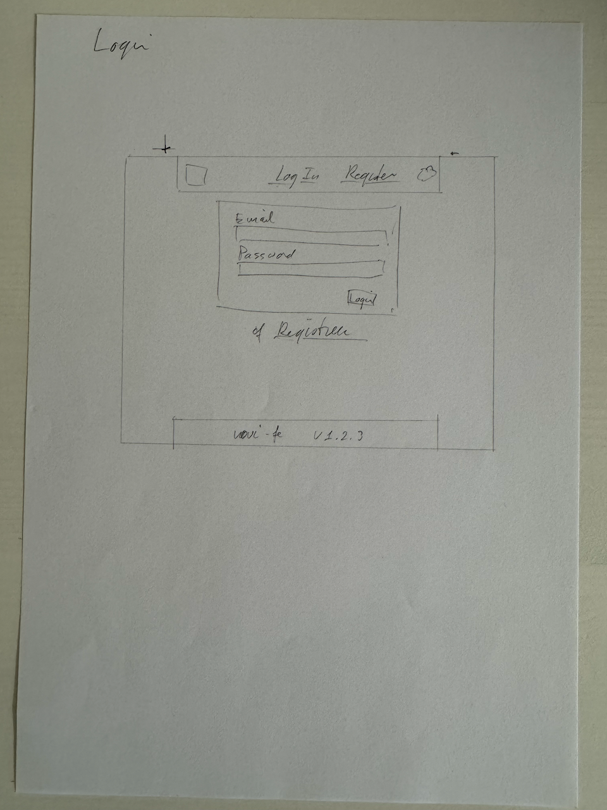
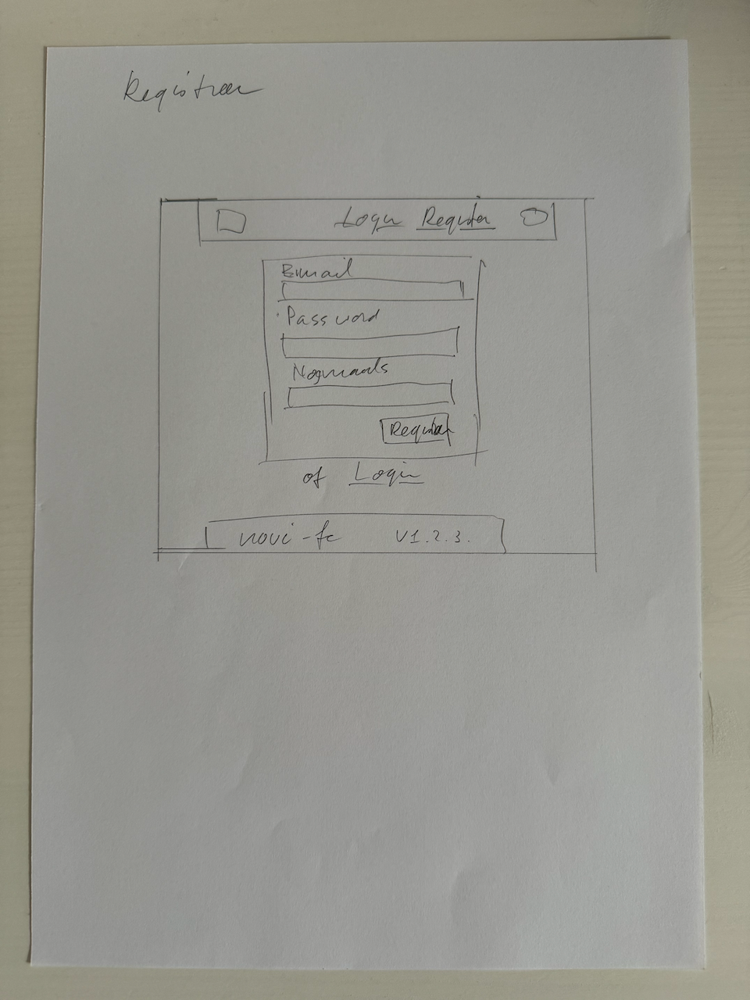
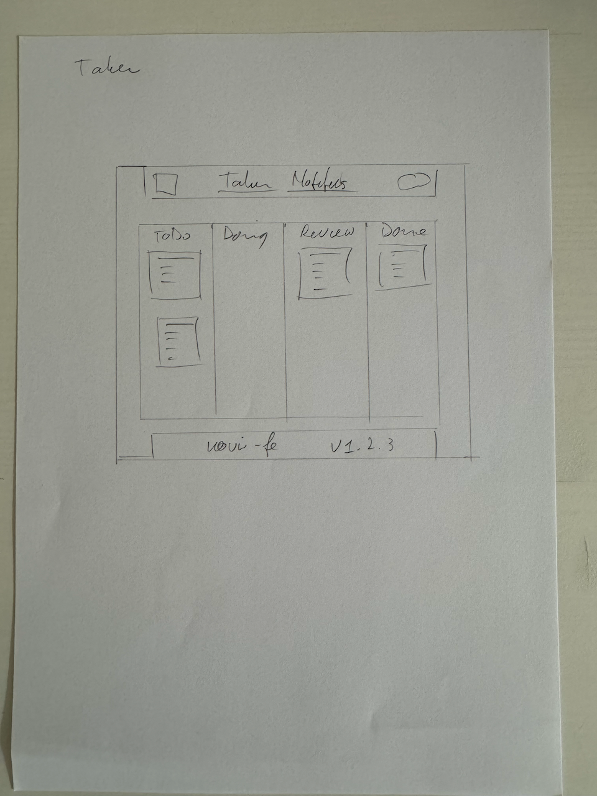
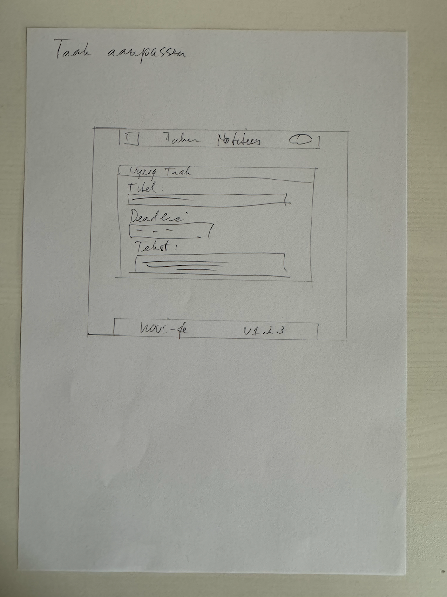
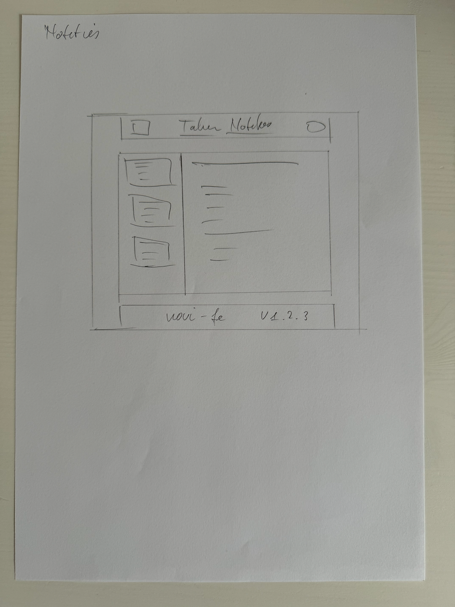

# Wireframes

Conform de eis in "Integrale eindopdracht Frontend v.3.3", hoofdstuk "Deelopdracht 1. Functioneel ontwerp", worden in dit document een aantal zg. **wireframes** gepresenteerd. Deze wireframes zijn getekend op papier, met potlood en gebruik makend van een geo-driehoek omdat het anders wel erg rommelig werd. Na afronding van de wireframes zijn de vijf vellen papier gefotografeerd en in de folder `wireframes` geplaatst.

## Login

Het **Login** scherm is zeer eenvoudig: de gebruiker voert een email adres en het bijbehorende password in, waarmee die gebruiker eerder heeft geregistreerd.

Dit is ook het eerste scherm wat een gebruiker ziet als hij of zij naar de site gaat. Vanaf deze pagina kan alleen naar de registreer pagina genavigeerd worden.

## Registreer

Het **Registreer** scherm biedt de mogelijkheid om aan te melden als nieuwe gebruiker van de site.

Naam, email adres en twee keer password zijn allemaal verplichte velden. De twee password velden, `password` en `nogmaals`, moeten exact dezelfde string bevatten.

## Taken

Het **Taken** scherm is het eerste scherm waar een gebruiker op terecht komt na succesvol inloggen/aanmelden.

Het bevat vier kolommen met daarin "kaarten" waar de taak titel, eind datum en enige tekst op te vinden zijn.

Door een kaart op te pakken (klik vasthouden met de muis) en te slepen en vervolgens de muisknop weer los te laten kan de taak van status veranderd worden.

De taak kan ook gewijzigd worden, hiervoor wordt in de kaart een icoon- of tekst-link getoond, waarop geklikt kan worden, waarna de taak aangepast kan worden.

In de ToDo kolom komt ook een knop om een nieuwe taak aan te maken. Het invullen van de nieuwe taak gebruikt dezelfde editor als voor het aanpassen van een bestaande taak.

## Taak aanpassen

De editor om een bestaande taak aan te passen bevat drie velden: titel, deadline en tekst.

## Notities

Het **notities** scherm biedt een lijst van notities met een detail scherm waarop de inhoud van de geselecteerde notitie wordt getoond.

Net zoals voor taken kan een bestaande notitie aangepast worden of een nieuwe notitie aangemaakt worden.
